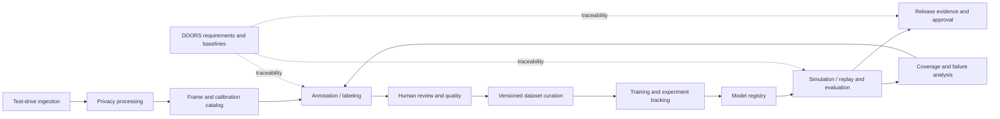

# ADAS development toolchain reference architecture

Illustrative only. The labeling service is one repository within this product.

| Service boundary | Owns | Consumes / produces |
|------------------|------|---------------------|
| Ingestion | Drive manifests and integrity checks | Synthetic sensor captures -> immutable drive IDs |
| Privacy | Authorized de-identification records | Raw frames -> policy-compliant frames |
| Frame catalog | Frame dimensions, orientation and calibration references | Immutable frame metadata |
| Labeling | Box geometry, revisions and review state | Frame metadata -> versioned annotation contracts |
| Dataset curation | Approved manifests and split policy | Reviewed labels -> immutable dataset versions |
| Training | Reproducible runs, parameters and metrics | Dataset version -> model candidate |
| Evaluation | Replay scenarios, metrics and requirement-linked evidence | Model candidate -> evaluation result |
| Release evidence | Human approval record and trace links | Validated evidence -> approved artifact references |

Shared rules: schema versioning, explicit units, correlation IDs, idempotent retries,
authorization at boundaries, immutable lineage and observable failures.
Transport, database and cloud choices are deliberately left open for the live plan.
Selecting them requires an ADR; the constitution is not a hidden technology mandate.

The demo feature validates submitted boxes; it does not claim to automatically
detect objects, train models, operate vehicles or validate the full toolchain.
